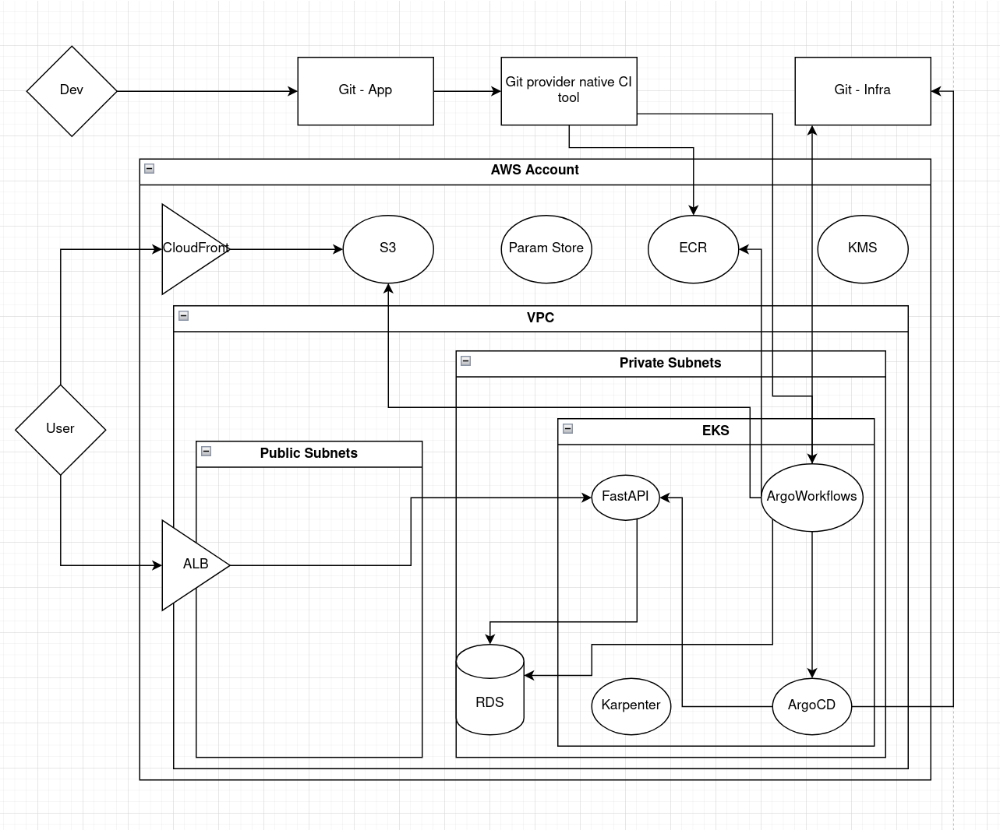

# Architecture Design for "Innovate Inc."
## Description
One of our clients is a small startup called "Innovate Inc." They are developing a web application (details below) and are looking to deploy it on one of the two major cloud providers(AWS or GCP). They have limited experience with cloud infrastructure and are seeking your expertise to design a robust, scalable, secure, and cost-effective solution. They are particularly interested in leveraging managed Kubernetes and following best practices.

## Application Details:

- Type: Web application with a REST API backend and a single-page application (SPA) frontend.

- Technology Stack: Backend: Python/Flask, Frontend: React, Database: PostgreSQL.

- Traffic: The expected initial load is low (a few hundred users per day), but they anticipate rapid growth to potentially millions of users.

- Data: Sensitive user data is handled, requiring strong security measures.

- Deployment Frequency: Aiming for continuous integration and continuous delivery (CI/CD).

## Assignment:

Create an architectural design document for Innovate Inc.'s Cloud infrastructure. The document should address the following key areas:

- Cloud Environment Structure:

  - Recommend the optimal number and purpose of AWS accounts/GCP  Projects for Innovate Inc. and justify your choice. Consider best practices for isolation, billing, and management.

- Network Design:

  - Design the Virtual Private Cloud (VPC) architecture.

  - Describe how you will secure the network.

- Compute Platform:

  - Detail how you will leverage Kubernetes Service to deploy and manage the application.

  - Describe your approach to node groups, scaling, and resource allocation within the cluster.

  - Explain your strategy for containerization, including image building, registry, and deployment processes.

- Database:

  - Recommend the appropriate service for the PostgreSQL database and justify your choice.

  - Outline your approach to database backups, high availability, and disaster recovery.

Deliverables: A git repository (you may include this in the git repository from the other task) containing a README architecture document with at least one HDL (High-Level Diagram) to illustrate the architecture.

---

# My Design

I am assuming the setup is completely fresh and not a migration from an old system so that having Frontend hosted on S3, for example, doesn't break any custom routing logic that had previously existed.
I am also intentionally not going into too many details knowing that this is a mindset check rather than an actual offer to a potential client, assuming that some things are known even if not said.
Since I haven't worked with GCP I am only elaborating on the AWS setup.
The diagram below is missing some parts with the goal to minimise the "visual noise" and to be as easily readable as possible.

### Cloud Environment Structure

Infrastructure separated into multiple AWS Accounts:

1. Management Account - controls Organisation(s), Accounts, Service Control Policies (if used), centralised billing
2. Security Account - controls everything security related, like GuardDuty, IAM Access Analiser, CloudTrail logs, VPC Flow logs...
3. Network Account - centralised network control, like VPN, Transit Gateways, Route53 Private zones...

Depending on the development workflow and the type of the workload the app is doing as well as various legal requirements:

4. At least one non-prod account for, well, everything non-prod
5. At least one prod account for the production workload

This way we have "one account to rule them all", consolidated billing in a single account, all the security in a single place for easier management, standards enforcement, auditing, easier networking setup between the accounts with a single place to control it all from.

### Network Design

This will sound generic, but I don't know how to put it in a different way:

Least-privilege access controlled by security groups. IGW and NAT for Public and Private subnets for internet connectivity. Given that we don't know if we will need any transit gateways or VPC peering.

Origin Access Control for S3 bucket from CF Distribution, FastAPI accessible only from the ALB, database accessible only from FastAPI and ArgoCD or Argo Workflows, whatever is performing db schema migrations, use IRSA for Kubernetes pods with permissions for exactly and only what they need them for, that kind of approach.

### Compute Platform

Use EKS. Use a dedicated node pool of EC2 instances for the core things like Karpenter, CoreDNS, Kube Proxy... Optionally use Fargate instances for those.

For application and background workload use separate node groups controlled by Karpenter. Optimise both pods and nodes for the workload that would run and that we would expect to be run.
Use HPA alongside Karpenter.

#### CI/CD

CI would happen on the Git provider side within their native CI tool that they provide. It would run unit tests, security checks, and ultimately build the app image and push it to ECR.

Depending on the setup the database schema migrations would be performed either using Argo Workflows or ArgoCD as a preSync hook. Provided that that job is the only thing that needs to be done before the deployment of a new version is initialised we would either trigger Argo Workflows (through Argo Events) from within the CI process, or we would directly update the infra Git repo with the new parameters so ArgoCD can pick it up.

### Databases

If the finances allow it - I'd always go with Aurora over RDS, even though RDS itself is far away from hosting and maintaining your own DBMS on a server.

Provided that we are opting for Aurora - we have all of the questions answered: it's multi-AZ, has automated backups, point-in-time recovery, read-replicas...
If we are to go with RDS, well, we would have to do some of that ourselves.

### Security

Even though the assignment doesn't directly ask for it, it still plays a great role in any setup, so I will just be generic here as I was in the network part:
- encrypt everything
- IAM with least-privilege access
- backup everything
- zero trust
- provided that you have it - no money is too much when invested in security